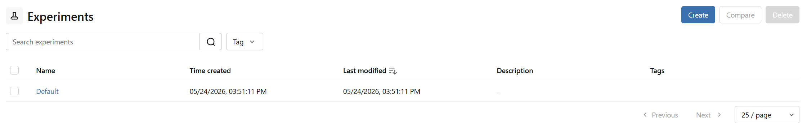
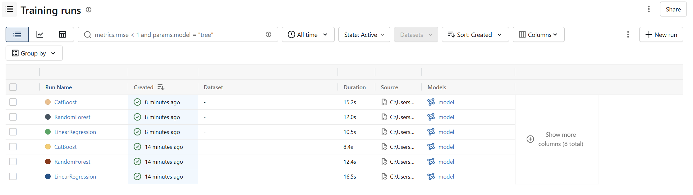
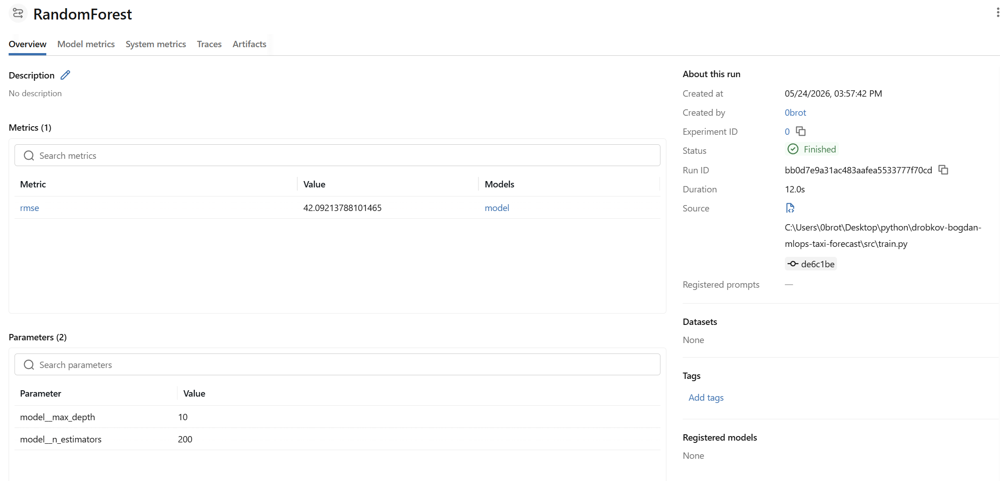
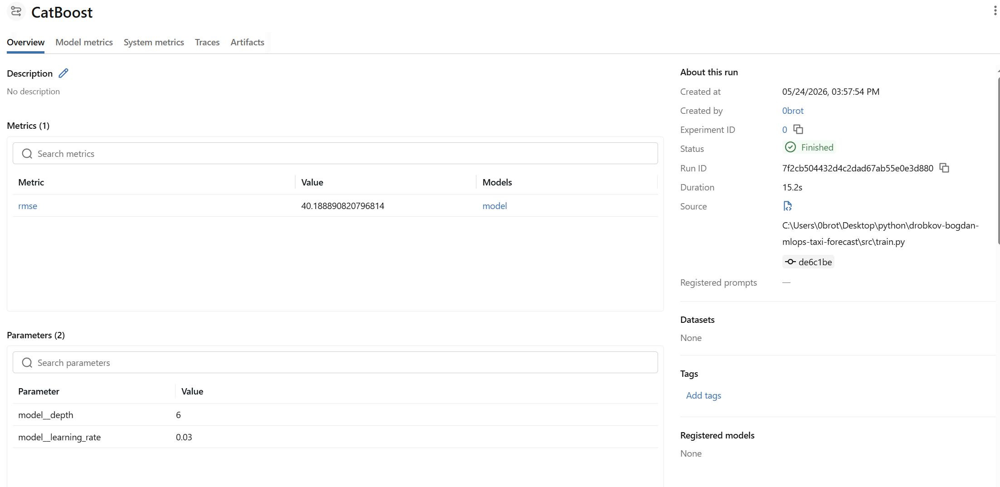
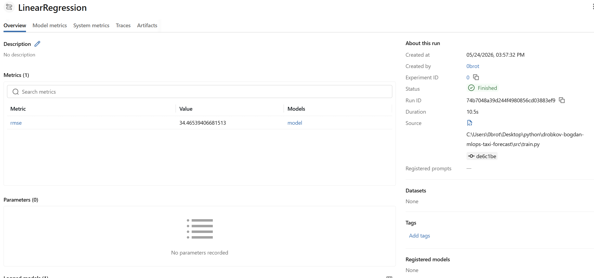
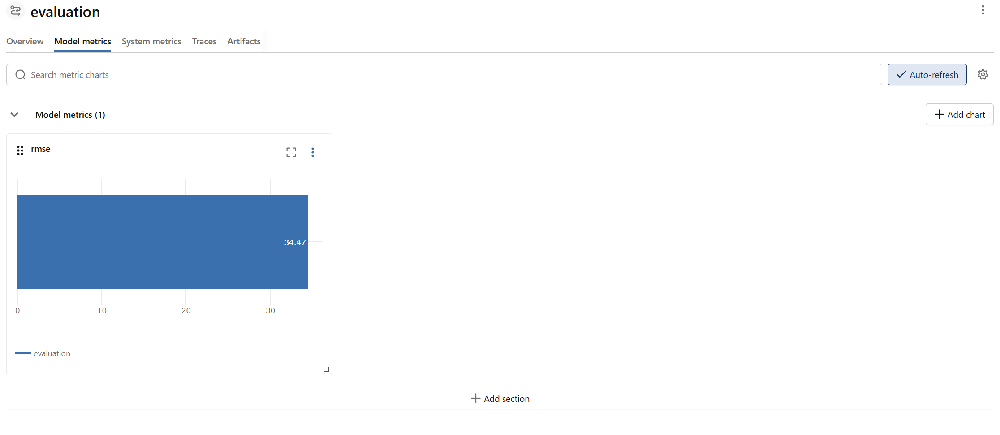
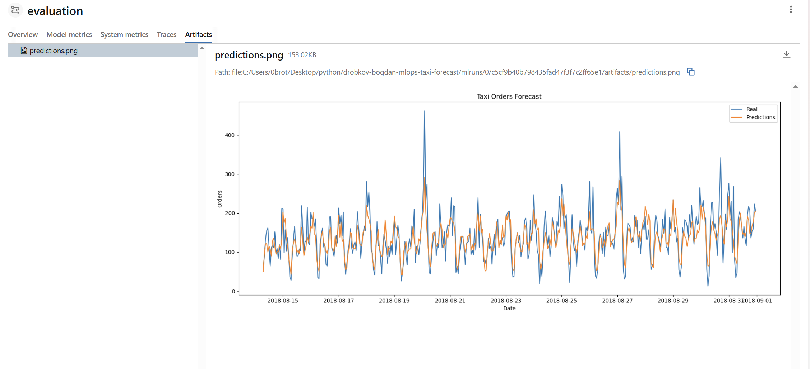
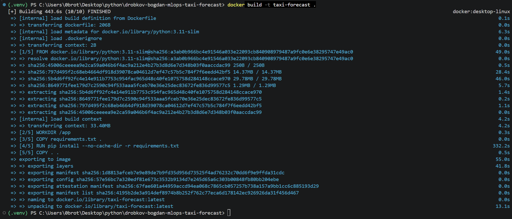
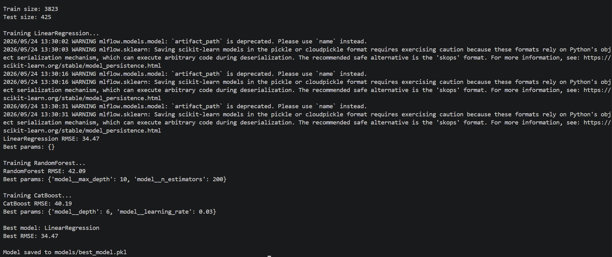
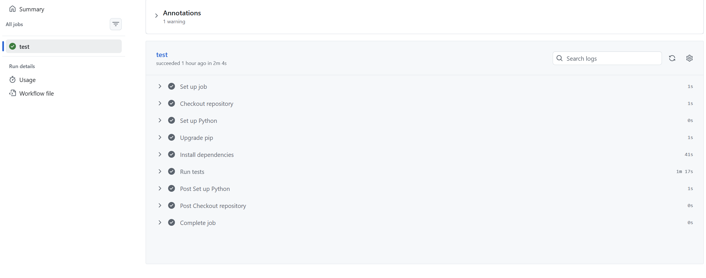

# Прогнозирование заказов такси — MLOps проект  
  
## Описание бизнес-задачи

Компания такси собирает исторические данные о количестве заказов в аэропортах.
Для эффективного распределения водителей необходимо заранее прогнозировать количество заказов на следующий час. 

Цель проекта:

- построить модель машинного обучения для прогнозирования числа заказов такси;
- автоматизировать процесс подготовки данных, обучения и тестирования модели;
- реализовать базовый MLOps pipeline.

Основная метрика качества:

- RMSE (Root Mean Squared Error)  

## Запуск проекта

git clone <repo_url>

cd drobkov-bogdan-mlops-taxi-forecast

python -m venv .venv

source .venv/bin/activate

Для Windows: .venv\Scripts\activate

Установка зависимостей: pip install -r requirements.txt

Обучение моделей: python -m src.train

Оценка модели: python -m src.evaluate

## Разведочный анализ данных (EDA)

В проекте был проведён предварительный анализ данных сервиса заказа такси.

На этапе EDA выполнялись:

- анализ структуры датасета;
- проверка типов данных;
- проверка ряда на стационарность; 
- анализ временного ряда заказов;
- проверка пропусков;
- Анализ выбросов;
- анализ распределения количества заказов;
- визуализация динамики заказов во времени;
- Анализ и визуализации сезоннности и тренда, остатков;
- построены ACF и PACF графики. 

Вывод EDA: временной ряд характеризуется выраженной суточной сезонностью, зависимостью от предыдущих значений и наличием долгосрочного тренда. Для моделирования целесообразно использовать лаговые признаки (в первую очередь lag_1, lag_24 и их кратные — lag_48, lag_72, lag_168), а также признаки времени (час, день недели). Добавление месяца избыточно т.к данные представлены только одним полугодием.

EDA: notebooks/EDA.ipynb

## Архитектура ML-модели

Архитектура ML-модели включает этап подготовки временных признаков, масштабирование данных при помощи StandardScaler и обучение нескольких алгоритмов регрессии: LinearRegression, RandomForestRegressor и CatBoostRegressor. Для выбора лучшей модели используется сравнение метрики RMSE на тестовой выборке.

  
## Схема пайплайна проекта  

Raw Data
   ↓
Preprocessing
   ↓
Feature Engineering
   ↓
Train/Test Split
   ↓
Model Training
   ↓
Hyperparameter Tuning
   ↓
Model Evaluation
   ↓
MLflow Logging
   ↓
Model Saving
   ↓
Testing & CI/CD
   ↓
Docker Container

## ETL-процесс

Данные загружаются из CSV-файла: data/raw/taxi.csv

На этапе преобразования выполняются: преобразование столбца datetime; установка datetime как индекса; ресемплирование данных по 1 часу;
создание временных признаков: hour,dayofweek,month; создание lag-признаков; создание rolling mean признаков; удаление пропусков после feature engineering.

## Автоматизация ML-пайплайна

В проекте реализована автоматизация отдельных этапов машинного обучения без использования готовых AutoML-платформ.

Автоматизированы следующие элементы:

- предобработка данных;
- генерация признаков;
- обучение нескольких моделей;
- подбор гиперпараметров;
- сравнение моделей по метрике RMSE;
- сохранение лучшей модели;
- логирование экспериментов в MLflow.

Для автоматического подбора параметров используется GridSearchCV из библиотеки Scikit-learn.
В рамках пайплайна автоматически обучаются три модели:

- LinearRegression
- RandomForestRegressor
- CatBoostRegressor

После обучения вычисляется метрика RMSE, а лучшая модель выбирается автоматически и сохраняется в директорию models/.

Таким образом реализован частично автоматизированный ML-пайплайн, позволяющий минимизировать ручное вмешательство при обучении и сравнении моделей. 

## Оценка модели (Evaluation)

Для оценки качества модели используется модуль evaluate.py.

В процессе evaluation выполняются:

- загрузка тестовых данных;
- загрузка сохранённой модели;
- построение предсказаний;
- вычисление метрики RMSE;
- построение графиков;
- логирование результатов в MLflow.
  
## Структура проекта

drobkov-bogdan-mlops-taxi-forecast/
│
├── data/                         # Директория с данными проекта
│   ├── raw/                      # Исходные необработанные данные
│   └── processed/                # Подготовленные данные после ETL
│
├── models/                       # Сохранённые обученные модели
│
├── notebooks/                    # EDA 
│
├── reports/                      # Отчёты и визуализации
│   └── figures/                  # Графики и изображения модели
│
├── src/                          # Основной исходный код проекта
│   ├── __init__.py               # Инициализация Python-пакета
│   ├── preprocess.py             # ETL и feature engineering
│   ├── train.py                  # Обучение моделей и MLflow logging
│   └── evaluate.py               # Оценка модели и построение графиков
│
├── tests/                        # Unit-тесты проекта
│   ├── test_model.py             # Тестирование обучения и модели
│   └── test_preprocess.py        # Тестирование preprocessing pipeline
│
├── .github/                      # Конфигурация GitHub Actions
│   └── workflows/
│       └── ci.yml                # CI pipeline для автоматического тестирования
│
├── Dockerfile                    # Конфигурация Docker-контейнера
├── requirements.txt              # Список зависимостей Python
├── .gitignore                    # Исключения файлов для Git
└── README.md                     # Документация проекта

## Тестирование

В проекте реализованы тесты:

- проверка preprocessing;
- проверка отсутствия пропусков;
- проверка обучения модели;
- проверка сохранения модели;
- проверка размера предсказаний.

Запуск тестов: python -m pytest  
  
## MLflow

MLflow использовался для:

- логирования экспериментов;
- сохранения параметров моделей;
- сохранения метрик;
- отслеживания результатов обучения.

Запуск интерфейса: mlflow ui

### MLflow Experiments



### MLflow runs



### MLflow models







### MLflow evaluate






## Docker

Проект был контейнеризирован с помощью Docker, что обеспечило воспроизводимость окружения и упростило запуск проекта на различных системах.

Dockerfile

FROM python:3.11-slim

WORKDIR /app

COPY requirements.txt .

RUN pip install --no-cache-dir -r requirements.txt

COPY . .

CMD ["python", "-m", "src.train"]

Описание команд Dockerfile
- FROM python:3.11-slim — использование облегчённого Python-образа;
- WORKDIR /app — установка рабочей директории контейнера;
- COPY requirements.txt . — копирование файла зависимостей;
- RUN pip install ... — установка библиотек проекта;
- COPY . . — копирование исходного кода;
- CMD [...] — запуск обучения модели при старте контейнера.

Сборка Docker-образа: docker build -t taxi-forecast .




Запуск контейнера: docker run taxi-forecast




## CI/CD

В проекте реализована система непрерывной интеграции (CI) с использованием GitHub Actions.

При каждом push или pull request автоматически выполняются:

- установка зависимостей;
- запуск тестов;
- проверка корректности ML-пайплайна.

Workflow расположен в: .github/workflows/ci.yml

Этапы CI-пайплайна
- Клонирование репозитория;
- Установка Python;
- Установка зависимостей из requirements.txt;
- Запуск тестов через pytest.

### CI/CD Pipeline 



## Используемые Git-команды

Проверка состояния файлов:

```bash
git status

Добавление файлов

```bash
git add .

Создание коммита:

```bash
git commit -m "Project update"

Отправка изменений в удалённый репозиторий:

```bash
git push


